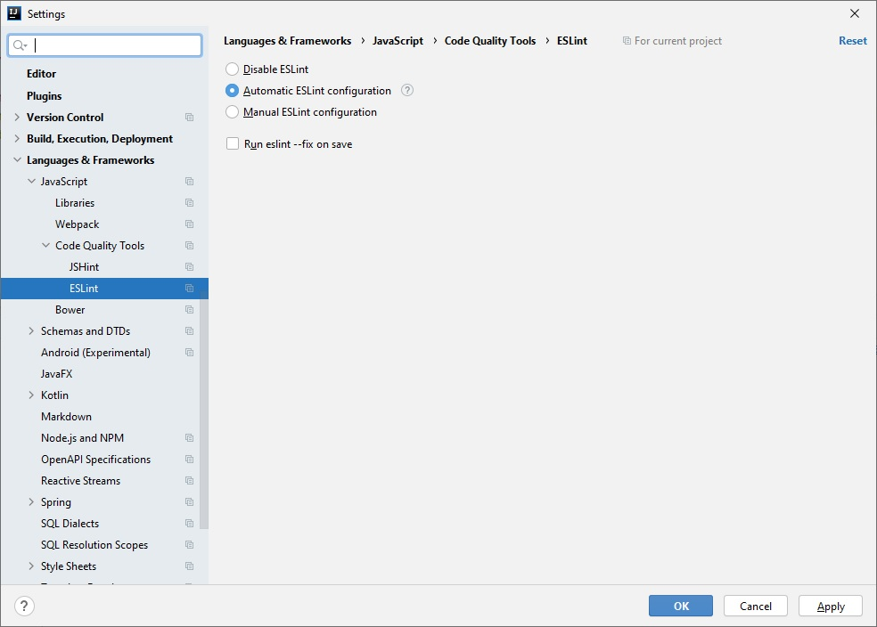

# ec-debugging-tools
Debugging tools for Gantt Chart of EC project.

## How to use it
Copy content of `src` folder to `ec-web/src/main/webapp/resources/js/gantt`, rename `..gitignore` to just `.gitignore`.

When all is in its right place, run command `npm i`. You have to have Node.js installed on your machine.

Then go to `File | Settings | Languages & Frameworks | JavaScript | Code Quality Tools | ESLint ` and set `Automatic ESLint configuration` or `Manua ESLint configuration` if IDEA does not detect correctly your setup.

